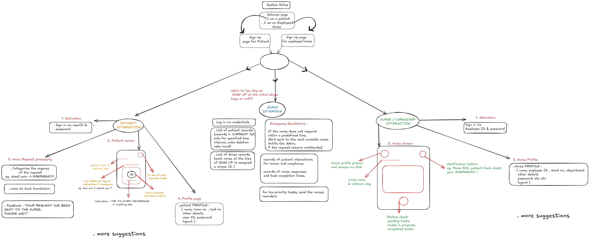

# Voice-Based Patient Call System

## Quick Navigation
- [Frontend Setup](#frontend-main-app-setup-and-running-instructions)
- [Admin App Setup](#admin-app-setup-and-running-instructions)
- [Voice System Setup](#voice-based-patient-call-system-1)
  - [Docker Setup](#option-1-using-docker)
  - [Python Virtual Environment Setup](#option-2-using-python-virtual-environment)

## Frontend (Main App) Setup and Running Instructions

### Prerequisites
- Node.js (v14 or higher)
- npm (Node Package Manager)

### Steps to Run Frontend
1. Navigate to the frontend directory:
   ```bash
   cd SpringBoardApp_Frontend
   cd CareConnect
   ```

2. Install dependencies:
   ```bash
   npm i
   ```

3. Start the development server:
   ```bash
   npx expo start
   ```
   The application will open in your default browser at `http://localhost:8081`

### Troubleshooting
- If you encounter any dependency issues, try deleting the `node_modules` folder and `package-lock.json` file, then run `npm install` again
- Make sure all required environment variables are set properly (if any)

## Admin App Setup and Running Instructions

### Prerequisites
- Node.js (v14 or higher)
- npm (Node Package Manager)

### Steps to Run Admin App
1. Navigate to the admin app directory:
   ```bash
   cd SpringBoardApp_AdminApp
   ```

2. Install dependencies:
   ```bash
   npm install
   ```

3. Start the development server:
   ```bash
   npm start
   ```
   The admin application will open in your default browser at `http://localhost:3000`

### Additional Information for Admin App
- The admin interface provides management capabilities for:
  - User management
  - Content management
  - System settings
  - Analytics dashboard

### Troubleshooting Admin App
- If you face CORS issues, ensure your backend API is properly configured
- For dependency issues, try:
  ```bash
  rm -rf node_modules
  rm package-lock.json
  npm install
  ```
- Check if all environment variables are correctly set in `.env` file

# Voice-Based Patient Call System

## Model Download
Download the model from the following link and place it in the model folder:

[Model Link]()

## Running the Application

### Option 1: Using Docker

1. **Build the Docker Container**
   ```bash
   # With sudo
   sudo docker-compose build --no-cache
   
   # Without sudo
   docker-compose build --no-cache
   ```

2. **Start the Docker Container**
   ```bash
   # With sudo
   sudo docker-compose up -d
   
   # Without sudo
   docker-compose up -d
   ```

3. **View Logs**
   ```bash
   # With sudo
   sudo docker-compose logs -f
   
   # Without sudo
   docker-compose logs -f
   ```

4. **Access the API**
   - API endpoint: `http://0.0.0.0:8000`
   - API documentation: `http://0.0.0.0:8000/docs`

### Option 2: Using Python Virtual Environment

1. **Create a Virtual Environment**
   ```bash
   python3 -m venv env
   ```

2. **Activate the Virtual Environment**
   ```bash
   # Linux/MacOS
   source env/bin/activate
   
   # Windows (Command Prompt)
   env\Scripts\activate
   
   # Windows (PowerShell)
   .\env\Scripts\Activate.ps1
   ```

3. **Install Requirements**
   ```bash
   pip install -r requirements.txt
   ```

4. **Run the Application with Uvicorn**
   ```bash
   uvicorn app:app --reload 
   ```

5. **Access the API**
   - API endpoint: `http://0.0.0.0:8000`
   - API documentation: `http://0.0.0.0:8000/docs`

6. **Stop the Application**
   - Press `Ctrl + C`

## Notes
- Ensure that Python 3.7 or above is installed on your system
- The `requirements.txt` file should include all the necessary dependencies to run the application
- Place the downloaded model in the specified model directory before running the application


## User Flow 

